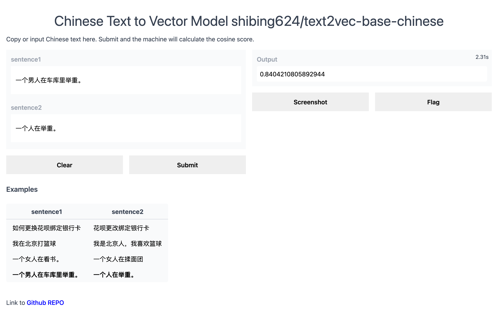
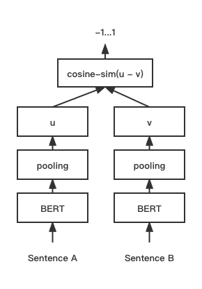
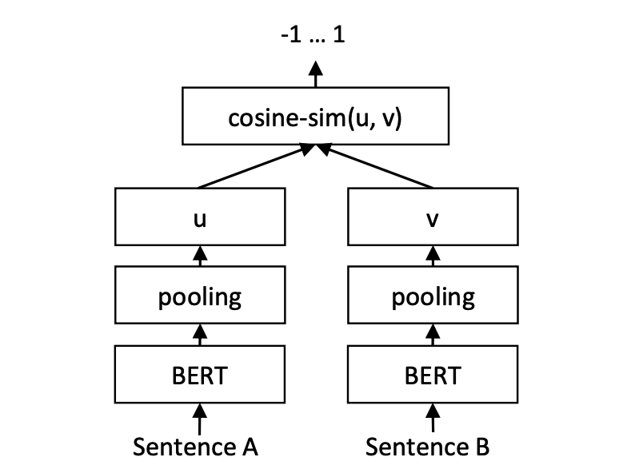
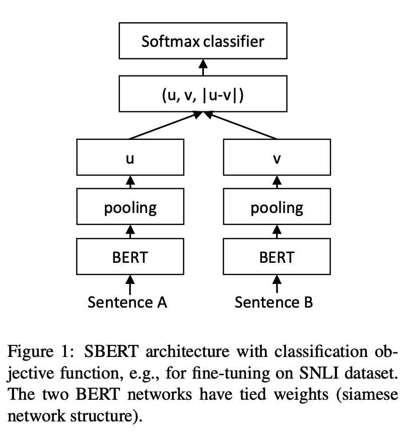
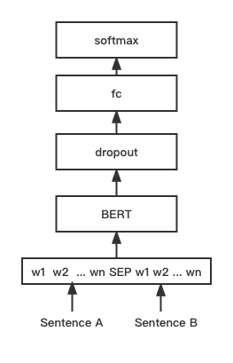

<div align="center">
  <a href="https://github.com/shibing624/text2vec">
    
  </a>
</div>

-----------------

# Text2vec: Text to Vector
[](https://badge.fury.io/py/text2vec)
[](https://pepy.tech/project/text2vec)
[](CONTRIBUTING.md)
[](LICENSE)
[](requirements.txt)
[](https://github.com/shibing624/text2vec/issues)
[](#Contact)


**Text2vec**: Text to Vector, Get Sentence Embeddings. 文本向量化，把文本(包括词、句子、段落)表征为向量矩阵。

**text2vec**实现了Word2Vec、RankBM25、BERT、Sentence-BERT、CoSENT等多种文本表征、文本相似度计算模型，并在文本语义匹配（相似度计算）任务上比较了各模型的效果。

### News
[2023/09/20] v1.2.9版本: 支持多卡推理（多进程实现多GPU、多CPU推理），新增命令行工具（CLI），可以脚本执行批量文本向量化，详见[Release-v1.2.9](https://github.com/shibing624/text2vec/releases/tag/1.2.9)

[2023/09/03] v1.2.4版本: 支持FlagEmbedding模型训练，发布了中文匹配模型[shibing624/text2vec-bge-large-chinese](https://huggingface.co/shibing624/text2vec-bge-large-chinese)，用CoSENT方法监督训练，基于`BAAI/bge-large-zh-noinstruct`用中文匹配数据集训练得到，并在中文测试集评估相对于原模型效果有提升，短文本区分度上提升明显，详见[Release-v1.2.4](https://github.com/shibing624/text2vec/releases/tag/1.2.4)

[2023/07/17] v1.2.2版本: 支持多卡训练，发布了多语言匹配模型[shibing624/text2vec-base-multilingual](https://huggingface.co/shibing624/text2vec-base-multilingual)，用CoSENT方法训练，基于`sentence-transformers/paraphrase-multilingual-MiniLM-L12-v2`用人工挑选后的多语言STS数据集[shibing624/nli-zh-all/text2vec-base-multilingual-dataset](https://huggingface.co/datasets/shibing624/nli-zh-all/tree/main/text2vec-base-multilingual-dataset)训练得到，并在中英文测试集评估相对于原模型效果有提升，详见[Release-v1.2.2](https://github.com/shibing624/text2vec/releases/tag/1.2.2)

[2023/06/19] v1.2.1版本: 更新了中文匹配模型`shibing624/text2vec-base-chinese-nli`为新版[shibing624/text2vec-base-chinese-sentence](https://huggingface.co/shibing624/text2vec-base-chinese-sentence)，针对CoSENT的loss计算对排序敏感特点，人工挑选并整理出高质量的有相关性排序的STS数据集[shibing624/nli-zh-all/text2vec-base-chinese-sentence-dataset](https://huggingface.co/datasets/shibing624/nli-zh-all/tree/main/text2vec-base-chinese-sentence-dataset)，在各评估集表现相对之前有提升；发布了适用于s2p的中文匹配模型[shibing624/text2vec-base-chinese-paraphrase](https://huggingface.co/shibing624/text2vec-base-chinese-paraphrase)，详见[Release-v1.2.1](https://github.com/shibing624/text2vec/releases/tag/1.2.1)

[2023/06/15] v1.2.0版本: 发布了中文匹配模型[shibing624/text2vec-base-chinese-nli](https://huggingface.co/shibing624/text2vec-base-chinese-nli)，基于`nghuyong/ernie-3.0-base-zh`模型，使用了中文NLI数据集[shibing624/nli_zh](https://huggingface.co/datasets/shibing624/nli_zh)全部语料训练的CoSENT文本匹配模型，在各评估集表现提升明显，详见[Release-v1.2.0](https://github.com/shibing624/text2vec/releases/tag/1.2.0)

[2022/03/12] v1.1.4版本: 发布了中文匹配模型[shibing624/text2vec-base-chinese](https://huggingface.co/shibing624/text2vec-base-chinese)，基于中文STS训练集训练的CoSENT匹配模型。详见[Release-v1.1.4](https://github.com/shibing624/text2vec/releases/tag/1.1.4)


**Guide**
- [Features](#Features)
- [Evaluation](#Evaluation)
- [Install](#install)
- [Usage](#usage)
- [Contact](#Contact)
- [References](#references)


## Features
### 文本向量表示模型
- [Word2Vec](https://github.com/shibing624/text2vec/blob/master/text2vec/word2vec.py)：通过腾讯AI Lab开源的大规模高质量中文[词向量数据（800万中文词轻量版）](https://pan.baidu.com/s/1La4U4XNFe8s5BJqxPQpeiQ) (文件名：light_Tencent_AILab_ChineseEmbedding.bin 密码: tawe）实现词向量检索，本项目实现了句子（词向量求平均）的word2vec向量表示
- [SBERT(Sentence-BERT)](https://github.com/shibing624/text2vec/blob/master/text2vec/sentencebert_model.py)：权衡性能和效率的句向量表示模型，训练时通过有监督训练BERT和softmax分类函数，文本匹配预测时直接取句子向量做余弦，句子表征方法，本项目基于PyTorch复现了Sentence-BERT模型的训练和预测
- [CoSENT(Cosine Sentence)](https://github.com/shibing624/text2vec/blob/master/text2vec/cosent_model.py)：CoSENT模型提出了一种排序的损失函数，使训练过程更贴近预测，模型收敛速度和效果比Sentence-BERT更好，本项目基于PyTorch实现了CoSENT模型的训练和预测
- [BGE(BAAI general embedding)](https://github.com/shibing624/text2vec/blob/master/text2vec/bge_model.py)：BGE模型按照[retromae](https://github.com/staoxiao/RetroMAE)方法进行预训练，[参考论文](https://aclanthology.org/2022.emnlp-main.35.pdf)，再使用对比学习finetune微调训练模型，本项目基于PyTorch实现了BGE模型的微调训练和预测


详细文本向量表示方法见wiki: [文本向量表示方法](https://github.com/shibing624/text2vec/wiki/%E6%96%87%E6%9C%AC%E5%90%91%E9%87%8F%E8%A1%A8%E7%A4%BA%E6%96%B9%E6%B3%95)
## Evaluation

文本匹配

#### 英文匹配数据集的评测结果：


| Arch   | BaseModel                                        | Model                                                                                                                | English-STS-B | 
|:-------|:------------------------------------------------|:---------------------------------------------------------------------------------------------------------------------|:-------------:|
| GloVe  | glove                                           | Avg_word_embeddings_glove_6B_300d                                                                                    |     61.77     |
| BERT   | bert-base-uncased                               | BERT-base-cls                                                                                                        |     20.29     |
| BERT   | bert-base-uncased                               | BERT-base-first_last_avg                                                                                             |     59.04     |
| BERT   | bert-base-uncased                               | BERT-base-first_last_avg-whiten(NLI)                                                                                 |     63.65     |
| SBERT  | sentence-transformers/bert-base-nli-mean-tokens | SBERT-base-nli-cls                                                                                                   |     73.65     |
| SBERT  | sentence-transformers/bert-base-nli-mean-tokens | SBERT-base-nli-first_last_avg                                                                                        |     77.96     |
| CoSENT | bert-base-uncased                               | CoSENT-base-first_last_avg                                                                                           |     69.93     |
| CoSENT | sentence-transformers/bert-base-nli-mean-tokens | CoSENT-base-nli-first_last_avg                                                                                       |     79.68     |
| CoSENT | sentence-transformers/paraphrase-multilingual-MiniLM-L12-v2 | [shibing624/text2vec-base-multilingual](https://huggingface.co/shibing624/text2vec-base-multilingual)                |     80.12     |

#### 中文匹配数据集的评测结果：


| Arch   | BaseModel                    | Model           | ATEC  |  BQ   | LCQMC | PAWSX | STS-B |  Avg  | 
|:-------|:----------------------------|:--------------------|:-----:|:-----:|:-----:|:-----:|:-----:|:-----:|
| SBERT  | bert-base-chinese           | SBERT-bert-base     | 46.36 | 70.36 | 78.72 | 46.86 | 66.41 | 61.74 |
| SBERT  | hfl/chinese-macbert-base    | SBERT-macbert-base  | 47.28 | 68.63 | 79.42 | 55.59 | 64.82 | 63.15 |
| SBERT  | hfl/chinese-roberta-wwm-ext | SBERT-roberta-ext   | 48.29 | 69.99 | 79.22 | 44.10 | 72.42 | 62.80 |
| CoSENT | bert-base-chinese           | CoSENT-bert-base    | 49.74 | 72.38 | 78.69 | 60.00 | 79.27 | 68.01 |
| CoSENT | hfl/chinese-macbert-base    | CoSENT-macbert-base | 50.39 | 72.93 | 79.17 | 60.86 | 79.30 | 68.53 |
| CoSENT | hfl/chinese-roberta-wwm-ext | CoSENT-roberta-ext  | 50.81 | 71.45 | 79.31 | 61.56 | 79.96 | 68.61 |

说明：
- 结果评测指标：spearman系数
- 为评测模型能力，结果均只用该数据集的train训练，在test上评估得到的表现，没用外部数据
- `SBERT-macbert-base`模型，是用SBert方法训练，运行[examples/training_sup_text_matching_model.py](https://github.com/shibing624/text2vec/blob/master/examples/training_sup_text_matching_model.py)代码可训练模型
- `sentence-transformers/paraphrase-multilingual-MiniLM-L12-v2`模型是用SBert训练，是`paraphrase-MiniLM-L12-v2`模型的多语言版本，支持中文、英文等


### Release Models
- 本项目release模型的中文匹配评测结果：

| Arch       | BaseModel                                                   | Model                                                                                                                                             | ATEC  |  BQ   | LCQMC | PAWSX | STS-B | SOHU-dd | SOHU-dc |    Avg    |  QPS  |
|:-----------|:------------------------------------------------------------|:--------------------------------------------------------------------------------------------------------------------------------------------------|:-----:|:-----:|:-----:|:-----:|:-----:|:-------:|:-------:|:---------:|:-----:|
| Word2Vec   | word2vec                                                    | [w2v-light-tencent-chinese](https://ai.tencent.com/ailab/nlp/en/download.html)                                                                    | 20.00 | 31.49 | 59.46 | 2.57  | 55.78 |  55.04  |  20.70  |   35.03   | 23769 |
| SBERT      | xlm-roberta-base                                            | [sentence-transformers/paraphrase-multilingual-MiniLM-L12-v2](https://huggingface.co/sentence-transformers/paraphrase-multilingual-MiniLM-L12-v2) | 18.42 | 38.52 | 63.96 | 10.14 | 78.90 |  63.01  |  52.28  |   46.46   | 3138  |
| CoSENT     | hfl/chinese-macbert-base                                    | [shibing624/text2vec-base-chinese](https://huggingface.co/shibing624/text2vec-base-chinese)                                                       | 31.93 | 42.67 | 70.16 | 17.21 | 79.30 |  70.27  |  50.42  |   51.61   | 3008  |
| CoSENT     | hfl/chinese-lert-large                                      | [GanymedeNil/text2vec-large-chinese](https://huggingface.co/GanymedeNil/text2vec-large-chinese)                                                   | 32.61 | 44.59 | 69.30 | 14.51 | 79.44 |  73.01  |  59.04  |   53.12   | 2092  |
| CoSENT     | nghuyong/ernie-3.0-base-zh                                  | [shibing624/text2vec-base-chinese-sentence](https://huggingface.co/shibing624/text2vec-base-chinese-sentence)                                     | 43.37 | 61.43 | 73.48 | 38.90 | 78.25 |  70.60  |  53.08  |   59.87   | 3089  |
| CoSENT     | nghuyong/ernie-3.0-base-zh                                  | [shibing624/text2vec-base-chinese-paraphrase](https://huggingface.co/shibing624/text2vec-base-chinese-paraphrase)                                 | 44.89 | 63.58 | 74.24 | 40.90 | 78.93 |  76.70  |  63.30  | **63.08** | 3066  |
| CoSENT     | sentence-transformers/paraphrase-multilingual-MiniLM-L12-v2 | [shibing624/text2vec-base-multilingual](https://huggingface.co/shibing624/text2vec-base-multilingual)                                             | 32.39 | 50.33 | 65.64 | 32.56 | 74.45 |  68.88  |  51.17  |   53.67   | 3138  |
| CoSENT     | BAAI/bge-large-zh-noinstruct                                | [shibing624/text2vec-bge-large-chinese](https://huggingface.co/shibing624/text2vec-bge-large-chinese)                                             | 38.41 | 61.34 | 71.72 | 35.15 | 76.44 |  71.81  |  63.15  |   59.72   |  844  |


说明：
- 结果评测指标：spearman系数
- `shibing624/text2vec-base-chinese`模型，是用CoSENT方法训练，基于`hfl/chinese-macbert-base`在中文STS-B数据训练得到，并在中文STS-B测试集评估达到较好效果，运行[examples/training_sup_text_matching_model.py](https://github.com/shibing624/text2vec/blob/master/examples/training_sup_text_matching_model.py)代码可训练模型，模型文件已经上传HF model hub，中文通用语义匹配任务推荐使用
- `shibing624/text2vec-base-chinese-sentence`模型，是用CoSENT方法训练，基于`nghuyong/ernie-3.0-base-zh`用人工挑选后的中文STS数据集[shibing624/nli-zh-all/text2vec-base-chinese-sentence-dataset](https://huggingface.co/datasets/shibing624/nli-zh-all/tree/main/text2vec-base-chinese-sentence-dataset)训练得到，并在中文各NLI测试集评估达到较好效果，运行[examples/training_sup_text_matching_model_jsonl_data.py](https://github.com/shibing624/text2vec/blob/master/examples/training_sup_text_matching_model_jsonl_data.py)代码可训练模型，模型文件已经上传HF model hub，中文s2s(句子vs句子)语义匹配任务推荐使用
- `shibing624/text2vec-base-chinese-paraphrase`模型，是用CoSENT方法训练，基于`nghuyong/ernie-3.0-base-zh`用人工挑选后的中文STS数据集[shibing624/nli-zh-all/text2vec-base-chinese-paraphrase-dataset](https://huggingface.co/datasets/shibing624/nli-zh-all/tree/main/text2vec-base-chinese-paraphrase-dataset)，数据集相对于[shibing624/nli-zh-all/text2vec-base-chinese-sentence-dataset](https://huggingface.co/datasets/shibing624/nli-zh-all/tree/main/text2vec-base-chinese-sentence-dataset)加入了s2p(sentence to paraphrase)数据，强化了其长文本的表征能力，并在中文各NLI测试集评估达到SOTA，运行[examples/training_sup_text_matching_model_jsonl_data.py](https://github.com/shibing624/text2vec/blob/master/examples/training_sup_text_matching_model_jsonl_data.py)代码可训练模型，模型文件已经上传HF model hub，中文s2p(句子vs段落)语义匹配任务推荐使用
- `shibing624/text2vec-base-multilingual`模型，是用CoSENT方法训练，基于`sentence-transformers/paraphrase-multilingual-MiniLM-L12-v2`用人工挑选后的多语言STS数据集[shibing624/nli-zh-all/text2vec-base-multilingual-dataset](https://huggingface.co/datasets/shibing624/nli-zh-all/tree/main/text2vec-base-multilingual-dataset)训练得到，并在中英文测试集评估相对于原模型效果有提升，运行[examples/training_sup_text_matching_model_jsonl_data.py](https://github.com/shibing624/text2vec/blob/master/examples/training_sup_text_matching_model_jsonl_data.py)代码可训练模型，模型文件已经上传HF model hub，多语言语义匹配任务推荐使用
- `shibing624/text2vec-bge-large-chinese`模型，是用CoSENT方法训练，基于`BAAI/bge-large-zh-noinstruct`用人工挑选后的中文STS数据集[shibing624/nli-zh-all/text2vec-base-chinese-paraphrase-dataset](https://huggingface.co/datasets/shibing624/nli-zh-all/tree/main/text2vec-base-chinese-paraphrase-dataset)训练得到，并在中文测试集评估相对于原模型效果有提升，在短文本区分度上提升明显，运行[examples/training_sup_text_matching_model_jsonl_data.py](https://github.com/shibing624/text2vec/blob/master/examples/training_sup_text_matching_model_jsonl_data.py)代码可训练模型，模型文件已经上传HF model hub，中文s2s(句子vs句子)语义匹配任务推荐使用
- `w2v-light-tencent-chinese`是腾讯词向量的Word2Vec模型，CPU加载使用，适用于中文字面匹配任务和缺少数据的冷启动情况
- 各预训练模型均可以通过transformers调用，如MacBERT模型：`--model_name hfl/chinese-macbert-base` 或者roberta模型：`--model_name uer/roberta-medium-wwm-chinese-cluecorpussmall`
- 为测评模型的鲁棒性，加入了未训练过的SOHU测试集，用于测试模型的泛化能力；为达到开箱即用的实用效果，使用了搜集到的各中文匹配数据集，数据集也上传到HF datasets[链接见下方](#数据集)
- 中文匹配任务实验表明，pooling最优是`EncoderType.FIRST_LAST_AVG`和`EncoderType.MEAN`，两者预测效果差异很小
- 中文匹配评测结果复现，可以下载中文匹配数据集到`examples/data`，运行 [tests/model_spearman.py](https://github.com/shibing624/text2vec/blob/master/tests/model_spearman.py) 代码复现评测结果
- QPS的GPU测试环境是Tesla V100，显存32GB

模型训练实验报告：[实验报告](https://github.com/shibing624/text2vec/blob/master/docs/model_report.md)
## Demo

Official Demo: https://www.mulanai.com/product/short_text_sim/

HuggingFace Demo: https://huggingface.co/spaces/shibing624/text2vec



run example: [examples/gradio_demo.py](https://github.com/shibing624/text2vec/blob/master/examples/gradio_demo.py) to see the demo:
```shell
python examples/gradio_demo.py
```

## Install
```shell
pip install torch # conda install pytorch
pip install -U text2vec
```

or

```shell
pip install torch # conda install pytorch
pip install -r requirements.txt

git clone https://github.com/shibing624/text2vec.git
cd text2vec
pip install --no-deps .
```

## Usage

### 文本向量表征

基于`pretrained model`计算文本向量：

```zsh
>>> from text2vec import SentenceModel
>>> m = SentenceModel()
>>> m.encode("如何更换花呗绑定银行卡")
Embedding shape: (768,)
```

example: [examples/computing_embeddings_demo.py](https://github.com/shibing624/text2vec/blob/master/examples/computing_embeddings_demo.py)

```python
import sys

sys.path.append('..')
from text2vec import SentenceModel
from text2vec import Word2Vec


def compute_emb(model):
    # Embed a list of sentences
    sentences = [
        '卡',
        '银行卡',
        '如何更换花呗绑定银行卡',
        '花呗更改绑定银行卡',
        'This framework generates embeddings for each input sentence',
        'Sentences are passed as a list of string.',
        'The quick brown fox jumps over the lazy dog.'
    ]
    sentence_embeddings = model.encode(sentences)
    print(type(sentence_embeddings), sentence_embeddings.shape)

    # The result is a list of sentence embeddings as numpy arrays
    for sentence, embedding in zip(sentences, sentence_embeddings):
        print("Sentence:", sentence)
        print("Embedding shape:", embedding.shape)
        print("Embedding head:", embedding[:10])
        print()


if __name__ == "__main__":
    # 中文句向量模型(CoSENT)，中文语义匹配任务推荐，支持fine-tune继续训练
    t2v_model = SentenceModel("shibing624/text2vec-base-chinese")
    compute_emb(t2v_model)

    # 支持多语言的句向量模型（CoSENT），多语言（包括中英文）语义匹配任务推荐，支持fine-tune继续训练
    sbert_model = SentenceModel("shibing624/text2vec-base-multilingual")
    compute_emb(sbert_model)

    # 中文词向量模型(word2vec)，中文字面匹配任务和冷启动适用
    w2v_model = Word2Vec("w2v-light-tencent-chinese")
    compute_emb(w2v_model)

```

output:
```
<class 'numpy.ndarray'> (7, 768)
Sentence: 卡
Embedding shape: (768,)

Sentence: 银行卡
Embedding shape: (768,)
 ... 
```

- 返回值`embeddings`是`numpy.ndarray`类型，shape为`(sentences_size, model_embedding_size)`，三个模型任选一种即可，推荐用第一个。
- `shibing624/text2vec-base-chinese`模型是CoSENT方法在中文STS-B数据集训练得到的，模型已经上传到huggingface的
模型库[shibing624/text2vec-base-chinese](https://huggingface.co/shibing624/text2vec-base-chinese)，
是`text2vec.SentenceModel`指定的默认模型，可以通过上面示例调用，或者如下所示用[transformers库](https://github.com/huggingface/transformers)调用，
模型自动下载到本机路径：`~/.cache/huggingface/transformers`
- `w2v-light-tencent-chinese`是通过gensim加载的Word2Vec模型，使用腾讯词向量`Tencent_AILab_ChineseEmbedding.tar.gz`计算各字词的词向量，句子向量通过单词词
向量取平均值得到，模型自动下载到本机路径：`~/.text2vec/datasets/light_Tencent_AILab_ChineseEmbedding.bin`
- `text2vec`支持多卡推理(计算文本向量): [examples/computing_embeddings_multi_gpu_demo.py](https://github.com/shibing624/text2vec/blob/master/examples/computing_embeddings_multi_gpu_demo.py)

#### Usage (HuggingFace Transformers)
Without [text2vec](https://github.com/shibing624/text2vec), you can use the model like this: 

First, you pass your input through the transformer model, then you have to apply the right pooling-operation on-top of the contextualized word embeddings.

example: [examples/use_origin_transformers_demo.py](https://github.com/shibing624/text2vec/blob/master/examples/use_origin_transformers_demo.py)

```python
import os
import torch
from transformers import AutoTokenizer, AutoModel

os.environ["KMP_DUPLICATE_LIB_OK"] = "TRUE"


# Mean Pooling - Take attention mask into account for correct averaging
def mean_pooling(model_output, attention_mask):
    token_embeddings = model_output[0]  # First element of model_output contains all token embeddings
    input_mask_expanded = attention_mask.unsqueeze(-1).expand(token_embeddings.size()).float()
    return torch.sum(token_embeddings * input_mask_expanded, 1) / torch.clamp(input_mask_expanded.sum(1), min=1e-9)


# Load model from HuggingFace Hub
tokenizer = AutoTokenizer.from_pretrained('shibing624/text2vec-base-chinese')
model = AutoModel.from_pretrained('shibing624/text2vec-base-chinese')
sentences = ['如何更换花呗绑定银行卡', '花呗更改绑定银行卡']
# Tokenize sentences
encoded_input = tokenizer(sentences, padding=True, truncation=True, return_tensors='pt')

# Compute token embeddings
with torch.no_grad():
    model_output = model(**encoded_input)
# Perform pooling. In this case, max pooling.
sentence_embeddings = mean_pooling(model_output, encoded_input['attention_mask'])
print("Sentence embeddings:")
print(sentence_embeddings)
```

#### Usage (sentence-transformers)
[sentence-transformers](https://github.com/UKPLab/sentence-transformers) is a popular library to compute dense vector representations for sentences.

Install sentence-transformers:
```shell
pip install -U sentence-transformers
```
Then load model and predict:
```python
from sentence_transformers import SentenceTransformer

m = SentenceTransformer("shibing624/text2vec-base-chinese")
sentences = ['如何更换花呗绑定银行卡', '花呗更改绑定银行卡']

sentence_embeddings = m.encode(sentences)
print("Sentence embeddings:")
print(sentence_embeddings)
```

#### `Word2Vec`词向量

提供两种`Word2Vec`词向量，任选一个：

  - 轻量版腾讯词向量 [百度云盘-密码:tawe](https://pan.baidu.com/s/1La4U4XNFe8s5BJqxPQpeiQ) 或 [谷歌云盘](https://drive.google.com/u/0/uc?id=1iQo9tBb2NgFOBxx0fA16AZpSgc-bG_Rp&export=download)，二进制文件，111M，是简化后的高频143613个词，每个词向量还是200维（跟原版一样），运行程序，自动下载到 `~/.text2vec/datasets/light_Tencent_AILab_ChineseEmbedding.bin`
  - 腾讯词向量-官方全量, 6.78G放到： `~/.text2vec/datasets/Tencent_AILab_ChineseEmbedding.txt`，腾讯词向量主页：https://ai.tencent.com/ailab/nlp/zh/index.html 词向量下载地址：https://ai.tencent.com/ailab/nlp/en/download.html  更多查看[腾讯词向量介绍-wiki](https://github.com/shibing624/text2vec/wiki/%E8%85%BE%E8%AE%AF%E8%AF%8D%E5%90%91%E9%87%8F%E4%BB%8B%E7%BB%8D)


### 命令行模式（CLI）

支持批量获取文本向量

code: [cli.py](https://github.com/shibing624/text2vec/blob/master/text2vec/cli.py)

```
> text2vec -h                                    
usage: text2vec [-h] --input_file INPUT_FILE [--output_file OUTPUT_FILE] [--model_type MODEL_TYPE] [--model_name MODEL_NAME] [--encoder_type ENCODER_TYPE]
                [--batch_size BATCH_SIZE] [--max_seq_length MAX_SEQ_LENGTH] [--chunk_size CHUNK_SIZE] [--device DEVICE]
                [--show_progress_bar SHOW_PROGRESS_BAR] [--normalize_embeddings NORMALIZE_EMBEDDINGS]

text2vec cli

optional arguments:
  -h, --help            show this help message and exit
  --input_file INPUT_FILE
                        input file path, text file, required
  --output_file OUTPUT_FILE
                        output file path, output csv file, default text_embs.csv
  --model_type MODEL_TYPE
                        model type: sentencemodel, word2vec, default sentencemodel
  --model_name MODEL_NAME
                        model name or path, default shibing624/text2vec-base-chinese
  --encoder_type ENCODER_TYPE
                        encoder type: MEAN, CLS, POOLER, FIRST_LAST_AVG, LAST_AVG, default MEAN
  --batch_size BATCH_SIZE
                        batch size, default 32
  --max_seq_length MAX_SEQ_LENGTH
                        max sequence length, default 256
  --chunk_size CHUNK_SIZE
                        chunk size to save partial results, default 1000
  --device DEVICE       device: cpu, cuda, default None
  --show_progress_bar SHOW_PROGRESS_BAR
                        show progress bar, default True
  --normalize_embeddings NORMALIZE_EMBEDDINGS
                        normalize embeddings, default False
  --multi_gpu MULTI_GPU
                        multi gpu, default False
```

run：

```shell
pip install text2vec -U
text2vec --input_file input.txt --output_file out.csv --batch_size 128 --multi_gpu True
```

> 输入文件（required）：`input.txt`

## 下游任务
### 1. 句子相似度计算

example: [examples/semantic_text_similarity_demo.py](https://github.com/shibing624/text2vec/blob/master/examples/semantic_text_similarity_demo.py)

```python
import sys

sys.path.append('..')
from text2vec import Similarity

# Two lists of sentences
sentences1 = ['如何更换花呗绑定银行卡',
              'The cat sits outside',
              'A man is playing guitar',
              'The new movie is awesome']

sentences2 = ['花呗更改绑定银行卡',
              'The dog plays in the garden',
              'A woman watches TV',
              'The new movie is so great']

sim_model = Similarity()
for i in range(len(sentences1)):
    for j in range(len(sentences2)):
        score = sim_model.get_score(sentences1[i], sentences2[j])
        print("{} \t\t {} \t\t Score: {:.4f}".format(sentences1[i], sentences2[j], score))
```

output:
```shell
如何更换花呗绑定银行卡 		 花呗更改绑定银行卡 		 Score: 0.9477
如何更换花呗绑定银行卡 		 The dog plays in the garden 		 Score: -0.1748
如何更换花呗绑定银行卡 		 A woman watches TV 		 Score: -0.0839
如何更换花呗绑定银行卡 		 The new movie is so great 		 Score: -0.0044
The cat sits outside 		 花呗更改绑定银行卡 		 Score: -0.0097
The cat sits outside 		 The dog plays in the garden 		 Score: 0.1908
The cat sits outside 		 A woman watches TV 		 Score: -0.0203
The cat sits outside 		 The new movie is so great 		 Score: 0.0302
A man is playing guitar 		 花呗更改绑定银行卡 		 Score: -0.0010
A man is playing guitar 		 The dog plays in the garden 		 Score: 0.1062
A man is playing guitar 		 A woman watches TV 		 Score: 0.0055
A man is playing guitar 		 The new movie is so great 		 Score: 0.0097
The new movie is awesome 		 花呗更改绑定银行卡 		 Score: 0.0302
The new movie is awesome 		 The dog plays in the garden 		 Score: -0.0160
The new movie is awesome 		 A woman watches TV 		 Score: 0.1321
The new movie is awesome 		 The new movie is so great 		 Score: 0.9591
```

> 句子余弦相似度值`score`范围是[-1, 1]，值越大越相似。

### 2. 文本匹配搜索

一般在文档候选集中找与query最相似的文本，常用于QA场景的问句相似匹配、文本相似检索等任务。


example: [examples/semantic_search_demo.py](https://github.com/shibing624/text2vec/blob/master/examples/semantic_search_demo.py)

```python
import sys

sys.path.append('..')
from text2vec import SentenceModel, cos_sim, semantic_search

embedder = SentenceModel()

# Corpus with example sentences
corpus = [
    '花呗更改绑定银行卡',
    '我什么时候开通了花呗',
    'A man is eating food.',
    'A man is eating a piece of bread.',
    'The girl is carrying a baby.',
    'A man is riding a horse.',
    'A woman is playing violin.',
    'Two men pushed carts through the woods.',
    'A man is riding a white horse on an enclosed ground.',
    'A monkey is playing drums.',
    'A cheetah is running behind its prey.'
]
corpus_embeddings = embedder.encode(corpus)

# Query sentences:
queries = [
    '如何更换花呗绑定银行卡',
    'A man is eating pasta.',
    'Someone in a gorilla costume is playing a set of drums.',
    'A cheetah chases prey on across a field.']

for query in queries:
    query_embedding = embedder.encode(query)
    hits = semantic_search(query_embedding, corpus_embeddings, top_k=5)
    print("\n\n======================\n\n")
    print("Query:", query)
    print("\nTop 5 most similar sentences in corpus:")
    hits = hits[0]  # Get the hits for the first query
    for hit in hits:
        print(corpus[hit['corpus_id']], "(Score: {:.4f})".format(hit['score']))
```
output:
```shell
Query: 如何更换花呗绑定银行卡
Top 5 most similar sentences in corpus:
花呗更改绑定银行卡 (Score: 0.9477)
我什么时候开通了花呗 (Score: 0.3635)
A man is eating food. (Score: 0.0321)
A man is riding a horse. (Score: 0.0228)
Two men pushed carts through the woods. (Score: 0.0090)

======================
Query: A man is eating pasta.
Top 5 most similar sentences in corpus:
A man is eating food. (Score: 0.6734)
A man is eating a piece of bread. (Score: 0.4269)
A man is riding a horse. (Score: 0.2086)
A man is riding a white horse on an enclosed ground. (Score: 0.1020)
A cheetah is running behind its prey. (Score: 0.0566)

======================
Query: Someone in a gorilla costume is playing a set of drums.
Top 5 most similar sentences in corpus:
A monkey is playing drums. (Score: 0.8167)
A cheetah is running behind its prey. (Score: 0.2720)
A woman is playing violin. (Score: 0.1721)
A man is riding a horse. (Score: 0.1291)
A man is riding a white horse on an enclosed ground. (Score: 0.1213)

======================
Query: A cheetah chases prey on across a field.
Top 5 most similar sentences in corpus:
A cheetah is running behind its prey. (Score: 0.9147)
A monkey is playing drums. (Score: 0.2655)
A man is riding a horse. (Score: 0.1933)
A man is riding a white horse on an enclosed ground. (Score: 0.1733)
A man is eating food. (Score: 0.0329)
```

 

## 下游任务支持库
**similarities库[推荐]**

文本相似度计算和文本匹配搜索任务，推荐使用 [similarities库](https://github.com/shibing624/similarities) ，兼容本项目release的
Word2vec、SBERT、Cosent类语义匹配模型，还支持亿级图文搜索，支持**文本语义去重**，**图片去重**等功能。

安装：
```pip install -U similarities```

句子相似度计算：
```python
from similarities import BertSimilarity

m = BertSimilarity()
r = m.similarity('如何更换花呗绑定银行卡', '花呗更改绑定银行卡')
print(f"similarity score: {float(r)}")  # similarity score: 0.855146050453186
```

## Models

### CoSENT model

CoSENT（Cosine Sentence）文本匹配模型，在Sentence-BERT上改进了CosineRankLoss的句向量方案


Network structure:

Training:




Inference:



#### CoSENT 监督模型
训练和预测CoSENT模型：

- 在中文STS-B数据集训练和评估`CoSENT`模型

example: [examples/training_sup_text_matching_model.py](https://github.com/shibing624/text2vec/blob/master/examples/training_sup_text_matching_model.py)

```shell
cd examples
python training_sup_text_matching_model.py --model_arch cosent --do_train --do_predict --num_epochs 10 --model_name hfl/chinese-macbert-base --output_dir ./outputs/STS-B-cosent
```

- 在蚂蚁金融匹配数据集ATEC上训练和评估`CoSENT`模型

支持这些中文匹配数据集的使用：'ATEC', 'STS-B', 'BQ', 'LCQMC', 'PAWSX'，具体参考HuggingFace datasets [https://huggingface.co/datasets/shibing624/nli_zh](https://huggingface.co/datasets/shibing624/nli_zh)
```shell
python training_sup_text_matching_model.py --task_name ATEC --model_arch cosent --do_train --do_predict --num_epochs 10 --model_name hfl/chinese-macbert-base --output_dir ./outputs/ATEC-cosent
```

- 在自有中文数据集上训练模型

example: [examples/training_sup_text_matching_model_mydata.py](https://github.com/shibing624/text2vec/blob/master/examples/training_sup_text_matching_model_mydata.py)

单卡训练：
```shell
CUDA_VISIBLE_DEVICES=0 python training_sup_text_matching_model_mydata.py --do_train --do_predict
```

多卡训练：
```shell
CUDA_VISIBLE_DEVICES=0,1 torchrun --nproc_per_node 2  training_sup_text_matching_model_mydata.py --do_train --do_predict --output_dir outputs/STS-B-text2vec-macbert-v1 --batch_size 64 --bf16 --data_parallel 
```

训练集格式参考[examples/data/STS-B/STS-B.valid.data](https://github.com/shibing624/text2vec/blob/master/examples/data/STS-B/STS-B.valid.data)

```shell
sentence1   sentence2   label
一个女孩在给她的头发做发型。	一个女孩在梳头。	2
一群男人在海滩上踢足球。	一群男孩在海滩上踢足球。	3
一个女人在测量另一个女人的脚踝。	女人测量另一个女人的脚踝。	5
```

`label`可以是0，1标签，0代表两个句子不相似，1代表相似；也可以是0-5的评分，评分越高，表示两个句子越相似。模型都能支持。


- 在英文STS-B数据集训练和评估`CoSENT`模型

example: [examples/training_sup_text_matching_model_en.py](https://github.com/shibing624/text2vec/blob/master/examples/training_sup_text_matching_model_en.py)

```shell
cd examples
python training_sup_text_matching_model_en.py --model_arch cosent --do_train --do_predict --num_epochs 10 --model_name bert-base-uncased  --output_dir ./outputs/STS-B-en-cosent
```

#### CoSENT 无监督模型
- 在英文NLI数据集训练`CoSENT`模型，在STS-B测试集评估效果

example: [examples/training_unsup_text_matching_model_en.py](https://github.com/shibing624/text2vec/blob/master/examples/training_unsup_text_matching_model_en.py)

```shell
cd examples
python training_unsup_text_matching_model_en.py --model_arch cosent --do_train --do_predict --num_epochs 10 --model_name bert-base-uncased --output_dir ./outputs/STS-B-en-unsup-cosent
```


### Sentence-BERT model

Sentence-BERT文本匹配模型，表征式句向量表示方案

Network structure:

Training:




Inference:


#### SentenceBERT 监督模型
- 在中文STS-B数据集训练和评估`SBERT`模型

example: [examples/training_sup_text_matching_model.py](https://github.com/shibing624/text2vec/blob/master/examples/training_sup_text_matching_model.py)

```shell
cd examples
python training_sup_text_matching_model.py --model_arch sentencebert --do_train --do_predict --num_epochs 10 --model_name hfl/chinese-macbert-base --output_dir ./outputs/STS-B-sbert
```
- 在英文STS-B数据集训练和评估`SBERT`模型

example: [examples/training_sup_text_matching_model_en.py](https://github.com/shibing624/text2vec/blob/master/examples/training_sup_text_matching_model_en.py)

```shell
cd examples
python training_sup_text_matching_model_en.py --model_arch sentencebert --do_train --do_predict --num_epochs 10 --model_name bert-base-uncased --output_dir ./outputs/STS-B-en-sbert
```

#### SentenceBERT 无监督模型
- 在英文NLI数据集训练`SBERT`模型，在STS-B测试集评估效果

example: [examples/training_unsup_text_matching_model_en.py](https://github.com/shibing624/text2vec/blob/master/examples/training_unsup_text_matching_model_en.py)

```shell
cd examples
python training_unsup_text_matching_model_en.py --model_arch sentencebert --do_train --do_predict --num_epochs 10 --model_name bert-base-uncased --output_dir ./outputs/STS-B-en-unsup-sbert
```

### BERT-Match model
BERT文本匹配模型，原生BERT匹配网络结构，交互式句向量匹配模型

Network structure:

Training and inference:



训练脚本同上[examples/training_sup_text_matching_model.py](https://github.com/shibing624/text2vec/blob/master/examples/training_sup_text_matching_model.py)。


### BGE model

#### BGE 监督模型
- 在中文STS-B数据集训练和评估`BGE`模型

example: [examples/training_bge_model_mydata.py](https://github.com/shibing624/text2vec/blob/master/examples/training_bge_model_mydata.py)

```shell
cd examples
python training_bge_model_mydata.py --model_arch bge --do_train --do_predict --num_epochs 4 --output_dir ./outputs/STS-B-bge-v1 --batch_size 4 --save_model_every_epoch --bf16
```

- 自建BGE训练集

BGE模型微调训练，使用对比学习训练模型，输入数据的格式是一个三元组' (query, positive, negative) '

```shell
cd examples/data
python build_zh_bge_dataset.py
python hard_negatives_mine.py
```
1. `build_zh_bge_dataset.py` 基于中文STS-B生成三元组训练集，格式如下：
```json lines
{"query":"一个男人正在往锅里倒油。","pos":["一个男人正在往锅里倒油。"],"neg":["亲俄军队进入克里米亚乌克兰海军基地","配有木制家具的优雅餐厅。","马雅瓦蒂要求总统统治查谟和克什米尔","非典还夺去了多伦多地区44人的生命，其中包括两名护士和一名医生。","在一次采访中，身为犯罪学家的希利说，这里和全国各地的许多议员都对死刑抱有戒心。","豚鼠吃胡萝卜。","狗嘴里叼着一根棍子在水中游泳。","拉里·佩奇说Android很重要，不是关键","法国、比利时、德国、瑞典、意大利和英国为印度计划向缅甸出售的先进轻型直升机提供零部件和技术。","巴林赛马会在动乱中进行"]}
```
2. `hard_negatives_mine.py` 使用faiss相似匹配，挖掘难负例。


### 模型蒸馏（Model Distillation）

由于text2vec训练的模型可以使用[sentence-transformers](https://github.com/UKPLab/sentence-transformers)库加载，此处复用其模型蒸馏方法[distillation](https://github.com/UKPLab/sentence-transformers/tree/master/examples/training/distillation)。

1. 模型降维，参考[dimensionality_reduction.py](https://github.com/UKPLab/sentence-transformers/blob/master/examples/training/distillation/dimensionality_reduction.py)使用PCA对模型输出embedding降维，可减少milvus等向量检索数据库的存储压力，还能轻微提升模型效果。
2. 模型蒸馏，参考[model_distillation.py](https://github.com/UKPLab/sentence-transformers/blob/master/examples/training/distillation/model_distillation.py)使用蒸馏方法，将Teacher大模型蒸馏到更少layers层数的student模型中，在权衡效果的情况下，可大幅提升模型预测速度。

### 模型部署

提供两种部署模型，搭建服务的方法： 1）基于Jina搭建gRPC服务【推荐】；2）基于FastAPI搭建原生Http服务。

#### Jina服务
采用C/S模式搭建高性能服务，支持docker云原生，gRPC/HTTP/WebSocket，支持多个模型同时预测，GPU多卡处理。

- 安装：
```pip install jina```

- 启动服务：

example: [examples/jina_server_demo.py](examples/jina_server_demo.py)
```python
from jina import Flow

port = 50001
f = Flow(port=port).add(
    uses='jinahub://Text2vecEncoder',
    uses_with={'model_name': 'shibing624/text2vec-base-chinese'}
)

with f:
    # backend server forever
    f.block()
```

该模型预测方法（executor）已经上传到[JinaHub](https://hub.jina.ai/executor/eq45c9uq)，里面包括docker、k8s部署方法。

- 调用服务：


```python
from jina import Client
from docarray import Document, DocumentArray

port = 50001

c = Client(port=port)

data = ['如何更换花呗绑定银行卡',
        '花呗更改绑定银行卡']
print("data:", data)
print('data embs:')
r = c.post('/', inputs=DocumentArray([Document(text='如何更换花呗绑定银行卡'), Document(text='花呗更改绑定银行卡')]))
print(r.embeddings)
```

批量调用方法见example: [examples/jina_client_demo.py](https://github.com/shibing624/text2vec/blob/master/examples/jina_client_demo.py)


#### FastAPI服务

- 安装：
```pip install fastapi uvicorn```

- 启动服务：

example: [examples/fastapi_server_demo.py](https://github.com/shibing624/text2vec/blob/master/examples/fastapi_server_demo.py)
```shell
cd examples
python fastapi_server_demo.py
```

- 调用服务：
```shell
curl -X 'GET' \
  'http://0.0.0.0:8001/emb?q=hello' \
  -H 'accept: application/json'
```


## Dataset

- 本项目release的数据集：

| Dataset                    | Introduce                                                                | Download Link                                                                                                                                                                                                                                                                                         |
|:---------------------------|:-------------------------------------------------------------------------|:------------------------------------------------------------------------------------------------------------------------------------------------------------------------------------------------------------------------------------------------------------------------------------------------------|
| shibing624/nli-zh-all      | 中文语义匹配数据合集，整合了文本推理，相似，摘要，问答，指令微调等任务的820万高质量数据，并转化为匹配格式数据集                | [https://huggingface.co/datasets/shibing624/nli-zh-all](https://huggingface.co/datasets/shibing624/nli-zh-all)                                                                                                                                                                                        |
| shibing624/snli-zh         | 中文SNLI和MultiNLI数据集，翻译自英文SNLI和MultiNLI                                    | [https://huggingface.co/datasets/shibing624/snli-zh](https://huggingface.co/datasets/shibing624/snli-zh)                                                                                                                                                                                              |
| shibing624/nli_zh          | 中文语义匹配数据集，整合了中文ATEC、BQ、LCQMC、PAWSX、STS-B共5个任务的数据集                        | [https://huggingface.co/datasets/shibing624/nli_zh](https://huggingface.co/datasets/shibing624/nli_zh) </br> or </br> [百度网盘(提取码:qkt6)](https://pan.baidu.com/s/1d6jSiU1wHQAEMWJi7JJWCQ) </br> or </br> [github](https://github.com/shibing624/text2vec/releases/download/1.1.2/senteval_cn.zip) </br> |
| shibing624/sts-sohu2021    | 中文语义匹配数据集，2021搜狐校园文本匹配算法大赛数据集                                            | [https://huggingface.co/datasets/shibing624/sts-sohu2021](https://huggingface.co/datasets/shibing624/sts-sohu2021)                                                                                                                                                                                    |
| ATEC                       | 中文ATEC数据集，蚂蚁金服Q-Qpair数据集                                                 | [ATEC](https://github.com/IceFlameWorm/NLP_Datasets/tree/master/ATEC)                                                                                                                                                                                                                                 |
| BQ                         | 中文BQ(Bank Question)数据集，银行Q-Qpair数据集                                      | [BQ](http://icrc.hitsz.edu.cn/info/1037/1162.htm)                                                                                                                                                                                                                                                     |
| LCQMC                      | 中文LCQMC(large-scale Chinese question matching corpus)数据集，Q-Qpair数据集      | [LCQMC](http://icrc.hitsz.edu.cn/Article/show/171.html)                                                                                                                                                                                                                                               |
| PAWSX                      | 中文PAWS(Paraphrase Adversaries from Word Scrambling)数据集，Q-Qpair数据集        | [PAWSX](https://arxiv.org/abs/1908.11828)                                                                                                                                                                                                                                                             |
| STS-B                      | 中文STS-B数据集，中文自然语言推理数据集，从英文STS-B翻译为中文的数据集                                 | [STS-B](https://github.com/pluto-junzeng/CNSD)                                                                                                                                                                                                                                                        |


常用英文匹配数据集：

- 英文匹配数据集：multi_nli: https://huggingface.co/datasets/multi_nli
- 英文匹配数据集：snli: https://huggingface.co/datasets/snli
- https://huggingface.co/datasets/metaeval/cnli
- https://huggingface.co/datasets/mteb/stsbenchmark-sts
- https://huggingface.co/datasets/JeremiahZ/simcse_sup_nli
- https://huggingface.co/datasets/MoritzLaurer/multilingual-NLI-26lang-2mil7


数据集使用示例：
```shell
pip install datasets
```

```python
from datasets import load_dataset

dataset = load_dataset("shibing624/nli_zh", "STS-B") # ATEC or BQ or LCQMC or PAWSX or STS-B
print(dataset)
print(dataset['test'][0])
```

output:
```shell
DatasetDict({
    train: Dataset({
        features: ['sentence1', 'sentence2', 'label'],
        num_rows: 5231
    })
    validation: Dataset({
        features: ['sentence1', 'sentence2', 'label'],
        num_rows: 1458
    })
    test: Dataset({
        features: ['sentence1', 'sentence2', 'label'],
        num_rows: 1361
    })
})
{'sentence1': '一个女孩在给她的头发做发型。', 'sentence2': '一个女孩在梳头。', 'label': 2}
```


## Contribute
项目代码还很粗糙，如果大家对代码有所改进，欢迎提交回本项目，在提交之前，注意以下两点：

 - 在`tests`添加相应的单元测试
 - 使用`python -m pytest -v`来运行所有单元测试，确保所有单测都是通过的

之后即可提交PR。

## References
- [将句子表示为向量（上）：无监督句子表示学习（sentence embedding）](https://www.cnblogs.com/llhthinker/p/10335164.html)
- [将句子表示为向量（下）：无监督句子表示学习（sentence embedding）](https://www.cnblogs.com/llhthinker/p/10341841.html)
- [A Simple but Tough-to-Beat Baseline for Sentence Embeddings[Sanjeev Arora and Yingyu Liang and Tengyu Ma, 2017]](https://openreview.net/forum?id=SyK00v5xx)
- [四种计算文本相似度的方法对比[Yves Peirsman]](https://zhuanlan.zhihu.com/p/37104535)
- [Improvements to BM25 and Language Models Examined](http://www.cs.otago.ac.nz/homepages/andrew/papers/2014-2.pdf)
- [CoSENT：比Sentence-BERT更有效的句向量方案](https://kexue.fm/archives/8847)
- [谈谈文本匹配和多轮检索](https://zhuanlan.zhihu.com/p/111769969)
- [Sentence-transformers](https://www.sbert.net/examples/applications/computing-embeddings/README.html)
- [One Embedder, Any Task: Instruction-Finetuned Text Embeddings](https://arxiv.org/abs/2212.09741)
